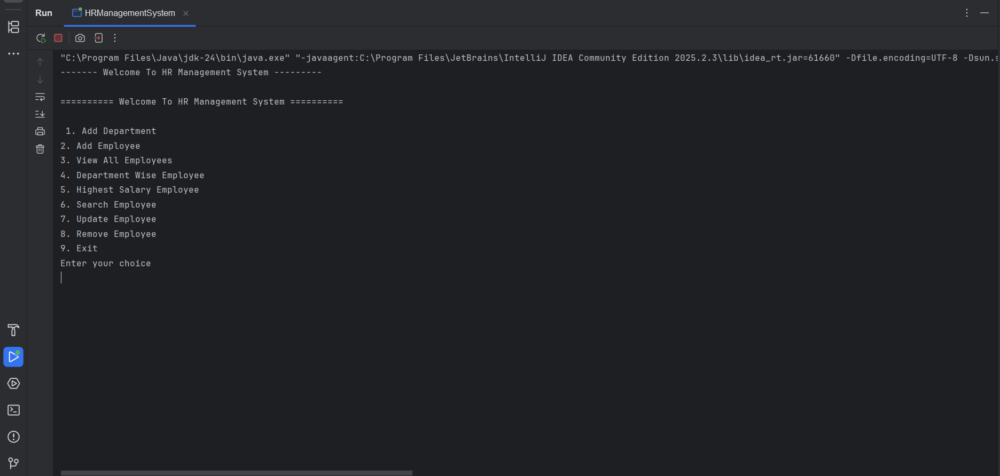
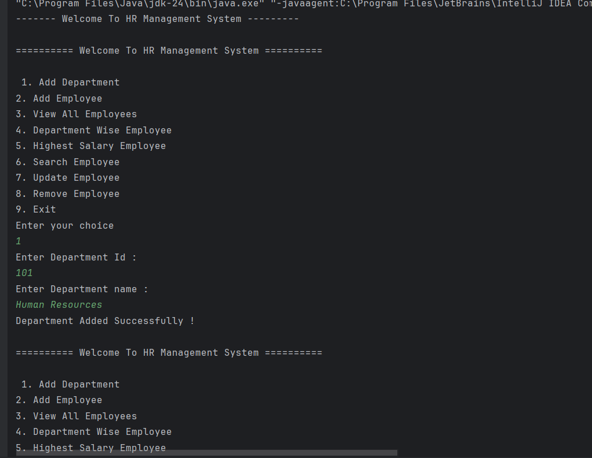
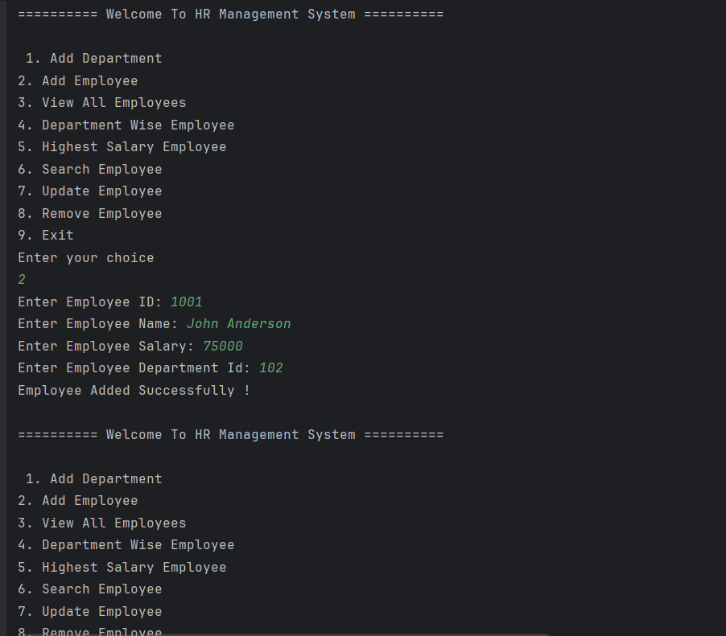
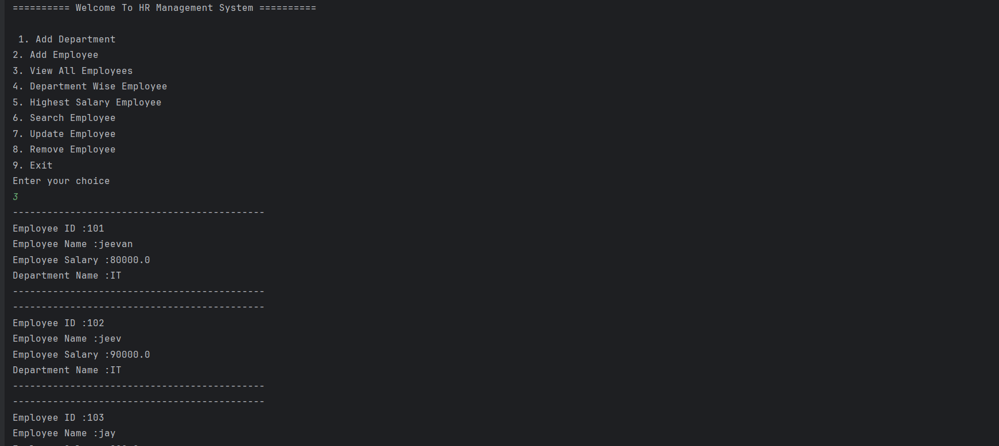
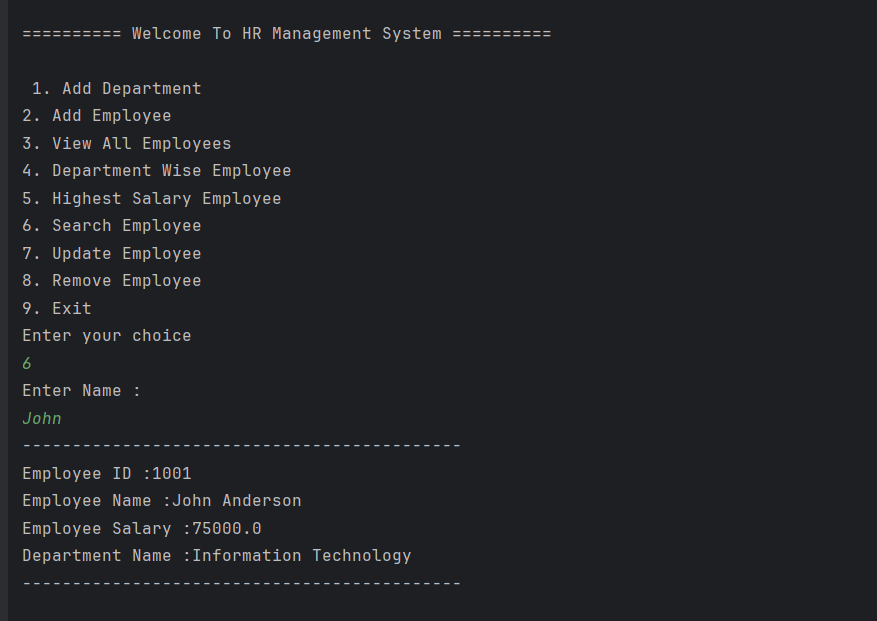
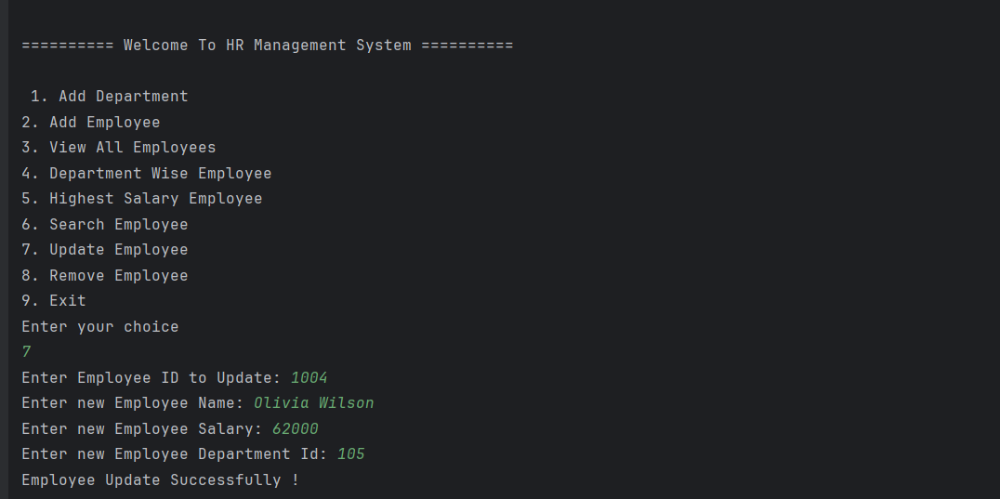
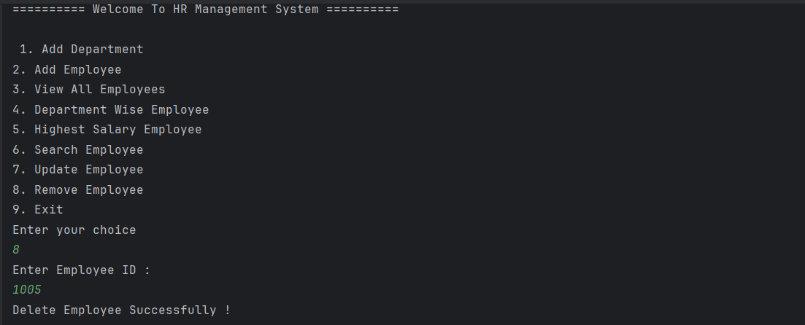
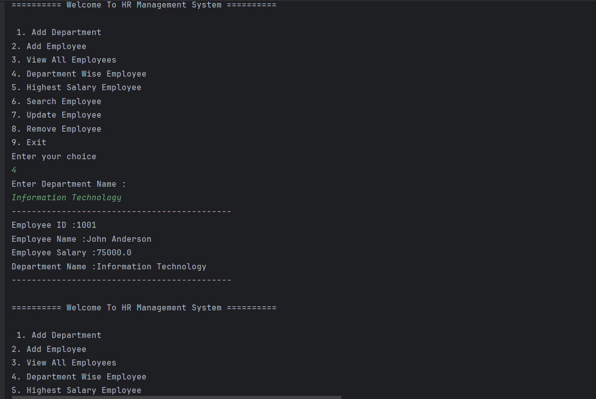
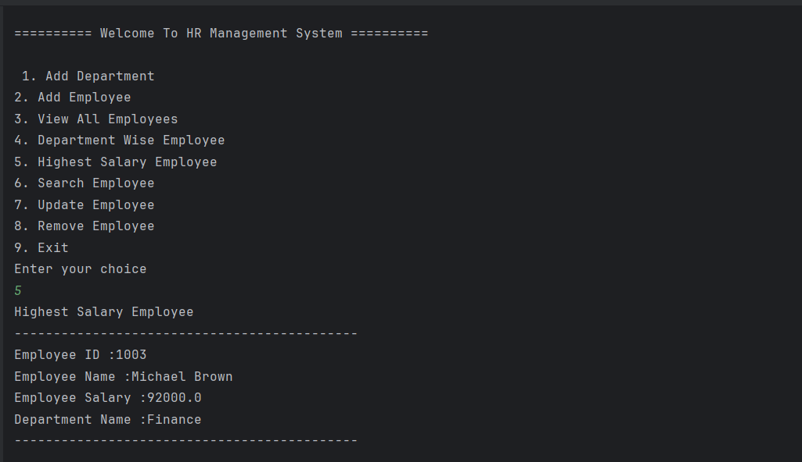
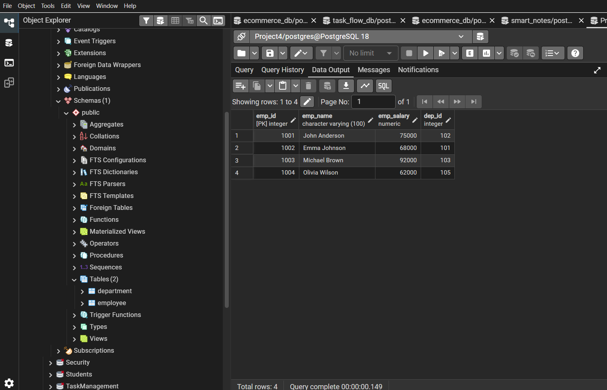

# 🚀 HR Management System

<div align="center">

# 🏢 HR Management System

### Console-Based Employee & Department Management System using Java, JDBC & PostgreSQL

<p align="center">


</p>

</div>

---

# 📖 Overview

HR Management System is a **Console-Based Employee Management Application** developed using **Java, JDBC, and PostgreSQL**.

The application allows organizations to manage departments and employees while performing complete CRUD (Create, Read, Update, Delete) operations through an interactive menu-driven console interface.

The project demonstrates real-world database interaction using JDBC, SQL queries, PreparedStatement, ResultSet handling, and Object-Oriented Programming principles.

It is designed to strengthen backend fundamentals before moving to enterprise Spring Boot development.

---

# ✨ Features

## 🏬 Department Management

- Add Department

---

## 👨‍💼 Employee Management

- Add Employee
- View All Employees
- Search Employee
- Update Employee
- Delete Employee

---

## 📊 Reports

- Department Wise Employees
- Highest Salary Employee

---

# 🛠 Tech Stack

| Technology | Used |
|------------|------|
| Java 21 | ✅ |
| JDBC | ✅ |
| PostgreSQL | ✅ |
| SQL | ✅ |
| PreparedStatement | ✅ |
| ResultSet | ✅ |
| OOP | ✅ |
| Console Application | ✅ |

---

# 🧩 Architecture

```
User

↓

Console Menu

↓

Java Application

↓

JDBC

↓

PostgreSQL Database
```

---

# 🗄 Database Design

## Department Table

```sql
CREATE TABLE department(
    dep_id INT PRIMARY KEY,
    dep_name VARCHAR(100)
);
```

## Employee Table

```sql
CREATE TABLE employee(
    emp_id INT PRIMARY KEY,
    emp_name VARCHAR(100),
    emp_salary DOUBLE PRECISION,
    dep_id INT REFERENCES department(dep_id)
);
```

---

# 📂 Project Structure

```
src
├── Department.java
├── Employee.java
├── HRManagementSystem.java
└── README.md
```

---

# ⚡ Core Functionalities

## 🏬 Department

- Add Department

---

## 👨‍💼 Employee

- Add Employee
- View Employees
- Search Employee
- Update Employee
- Delete Employee

---

## 📈 Reports

- Department Wise Employee Report
- Highest Salary Employee Report

---

# 🧪 Concepts Practiced

- Object-Oriented Programming (OOP)
- JDBC Connectivity
- CRUD Operations
- SQL JOIN Queries
- Foreign Key Relationships
- PreparedStatement
- ResultSet Handling
- Exception Handling
- Menu-Driven Programming

---

# ⚙️ Getting Started

## 1️⃣ Clone Repository

```bash
git clone https://github.com/jeevan-kaware/hr-management-system-java-jdbc-postgresql.git
```

```bash
cd hr-management-system-java-jdbc-postgresql
```

---

## 2️⃣ Create Database

Create a PostgreSQL database named

```text
hrms_db
```

Create both tables using the SQL queries provided above.

---

## 3️⃣ Configure JDBC

Update your database connection inside the Java source file.

```java
String url = "jdbc:postgresql://localhost:5432/hrms_db";
String username = "YOUR_USERNAME";
String password = "YOUR_PASSWORD";
```

---

## 4️⃣ Run Project

Compile and execute

```text
HRManagementSystem.java
```

---
# 📸 Application Screenshots

The following screenshots demonstrate the major functionalities of the HR Management System.

---

## 🏠 Main Menu



---

## 🏬 Add Department



---

## 👨‍💼 Add Employee



---

## 📋 View All Employees



---

## 🔍 Search Employee



---

## ✏️ Update Employee



---

## ❌ Delete Employee



---

## 📊 Department Wise Employee Report



---

## 🏆 Highest Salary Employee



---

## 🗄 PostgreSQL Database



---

# 🔄 Application Flow

```
Start Application

        │

        ▼

Console Menu

        │

        ▼

Select Operation

        │

        ▼

JDBC Connection

        │

        ▼

Execute SQL Query

        │

        ▼

PostgreSQL Database

        │

        ▼

Display Result

```

---

# 🧪 SQL Operations Used

The application performs real-world SQL operations through JDBC.

### INSERT

- Add Department
- Add Employee

---

### SELECT

- View All Employees
- Search Employee
- Department Wise Employees
- Highest Salary Employee

---

### UPDATE

- Update Employee Details

---

### DELETE

- Delete Employee Record

---

### SQL JOIN

Employee and Department data are combined using SQL JOIN queries to generate reports.

---

# 📚 Concepts Demonstrated

### ☕ Core Java

- Classes & Objects
- Constructors
- Encapsulation
- Method Calling
- Collections
- Exception Handling

---

### 🔗 JDBC

- DriverManager
- Connection
- PreparedStatement
- ResultSet
- SQL Execution
- Database Connectivity

---

### 🐘 PostgreSQL

- Tables
- Primary Keys
- Foreign Keys
- Relationships
- CRUD Operations
- SQL JOIN Queries

---

# 🧪 Testing

The application has been manually tested using multiple CRUD operations.

### Tested Features

- ✅ Add Department
- ✅ Add Employee
- ✅ View Employees
- ✅ Search Employee
- ✅ Update Employee
- ✅ Delete Employee
- ✅ Department Wise Report
- ✅ Highest Salary Report

All database operations execute successfully through JDBC with PostgreSQL.

---

# 🚀 Future Improvements

- JavaFX Desktop GUI
- Employee Login System
- User Authentication
- Role-Based Access Control
- Spring Boot REST API Version
- Spring Data JPA Integration
- Department CRUD
- Attendance Management
- Payroll Management
- Leave Management
- Employee Search Filters
- Export Reports (PDF / Excel)
- Docker Support
- Unit Testing (JUnit)
- CI/CD Pipeline
- Logging with Logback
- REST API Documentation using Swagger

---

# 💡 Learning Outcomes

This project helped me gain practical experience with:

- Core Java Programming
- Object-Oriented Programming (OOP)
- JDBC API
- PostgreSQL Database
- CRUD Operations
- SQL JOIN Queries
- Foreign Key Relationships
- PreparedStatement
- ResultSet Processing
- Exception Handling
- Console-Based Application Development
- Layered Code Organization
- Database Connectivity
- Menu-Driven Programming

---

# 👨‍💻 Author

**Jeevan Kaware**

Java Backend Developer

### GitHub

https://github.com/jeevan-kaware

### Repository

https://github.com/jeevan-kaware/hr-management-system-java-jdbc-postgresql

### LinkedIn

https://www.linkedin.com/in/jeevan-kaware-080643355

### Portfolio

https://smart-portfolio-kappa-eight.vercel.app/

---

# ⭐ If you like this project

If you found this project useful, consider giving it a ⭐ on GitHub.

It motivates me to build more professional Java Backend and Enterprise Applications.

---

<div align="center">

## 🚀 Built with Java, JDBC, PostgreSQL and ❤️

**Thank you for visiting this repository.**

</div>
